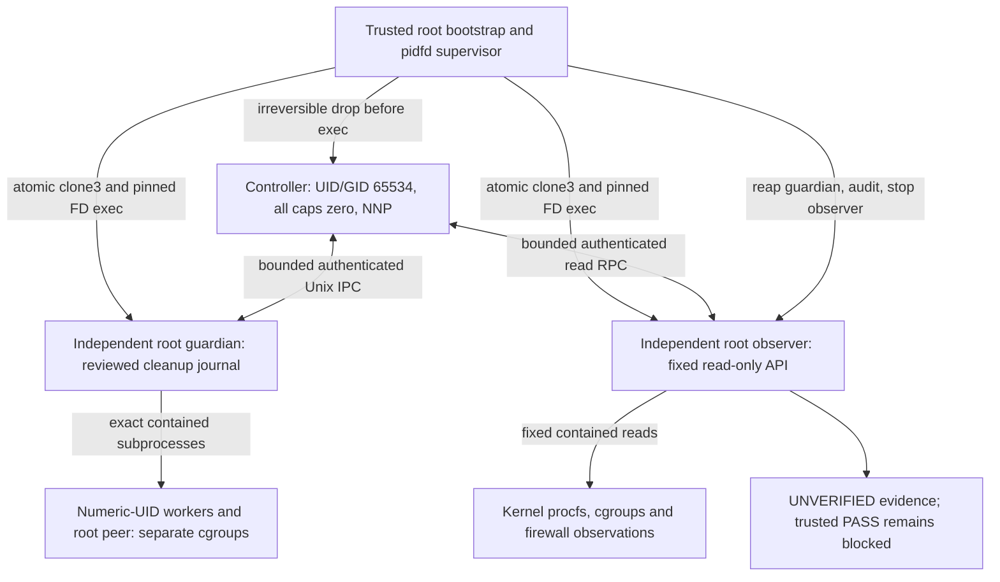

# Probe A — recovered implementation and adversarial engineering review

## Current remediation and native-source delivery, 2026-10-10

**PARTIAL — EXACT SOURCE OR ENVIRONMENT BLOCKERS.** The earlier completion/no-
confirmed-defect assessment below is historical and is superseded by this source
review. Concrete primitives have been added; the complete connected native
package still has S1–S6 source omissions. They are not approval-only gates.
All privileged components remain inert without explicit reviewed activation;
there is no native CLI/entry package, automatic privileged workflow or runtime
permission. No trusted runtime PASS can be produced by these changes.

### Immutable baseline and delivery scope

Work began on a clean `security/ha-mcp-phase2d-candidates` checkout at
`e483307c3c5ea157068b59c192f6fb0dea27dd1b`. Public GitHub metadata verified
[PR #2](https://github.com/Alundqvi97/hass-codex-tunnel-mcp/pull/2) open, DRAFT,
unmerged. The difference from reviewed source
`182c8b7c95513b83abc71f2d49ea82adde7ef4fa` contained only this review and the
implementation plan. Approved source gate
`ad5e0c2ba52901c8384597d3cafd26ce3ffb124d` remains an ancestor. Work continued
from that valid security branch rather than `main`; no existing changes were
discarded and no history was rewritten.

Final immutable **source/test revision**:
[`6a5d752412d7452008addcf93d78197322ecd157`](https://github.com/Alundqvi97/hass-codex-tunnel-mcp/commit/6a5d752412d7452008addcf93d78197322ecd157).
A subsequent documentation-only receipt commit contains this assessment, the
plan, [native package specification](PROBE_A_NATIVE_PACKAGE.md) and
[machine-readable coverage register](PROBE_A_NATIVE_COVERAGE.json). Its immutable
GitHub SHA is reported externally after commit, avoiding a self-hash. The
source/test tree is identical between those two revisions.

### Integration defect disposition

| Finding | Correction and verification | Remaining source limitation |
|---|---|---|
| INT-01 | The entire activated-root `TrustedActorBootstrap.launch_integrated` preparation, including property/import/constructor errors, is inside irreversible `_exit(76)` handling. Claim happens before factory preparation; an object-bound one-use receipt avoids a second claim. Disabled/unprivileged requests remain harmless. `OuterRootBoundaryTests` and claim-receipt regressions cover the actual outer route. | Mandatory hard-deadline and durable all-exit failure persistence remain S6; no runtime fail-stop claim is made. |
| INT-02 | Kernel-bound server-owned `CleanupAuditAuthority` follows observer `NativeReadCommands.for_audit` through `NativeBoundedCapture`, atomic spawner and `ReviewedExecutionContract.before_spawn`. Fixed audit reads retain the original 60-second reserve; controller/work requests stop at cutoff. Incremental bounded frames and audit-first turns avoid a stalled controller header monopolizing the audit channel. Tests exercise the actual command-to-spawn-contract path with only the kernel boundary simulated. | Native hard bounds for all verifier/factory/collection calls remain S6. No authorization/deadline extension or caller cleanup flag was introduced. |
| INT-03 | Evidence work and cleanup domains are distinct. Missing case/work facts cannot suppress available valid cleanup. Failed/cancelled work persists; nonzero guardian exit/interruption still attempts independent audit. Invalid authorities remain quarantined. Optional bounded unsigned partial-journal persistence exists. | **PARTIAL:** outer/pre-service/all-exit native persistence and final independent cleanup owner/measurement composition remain S5/S6. |

Three red baseline reproductions at `e483307` returned three errors and exit 1
before remediation (`/tmp/probe-a-red-baseline/results.log`). They reproduce
outer-root escape, audit reads rejected after cutoff and work-prefix suppression
of valid cleanup. They were not skipped, marked expected failures or weakened.

### Concrete native source and separate adversarial self-review

The coverage register lists all 22 critical hooks, exact functions, authority,
trusted responsibilities, configuration and future Linux acceptance assertions.
The specification documents actual topology, missing package wiring and the
unexecuted manifest-generation/verification process. New source:

- `probe_a_native_assembly.py`: actual private socket/memfd/pidfd allocation and
  existing GuardianCore/FixedWorkload/ClientProcess/native containment composition.
- `probe_a_native_ledger.py`: exclusive durable SQLite claims, restart/replay and
  lost-ack rejection, source/boot/policy/context-bound v2 existing-grant validation.
- `probe_a_native_inventory.py` and `probe_a_native_verifier.py`: retained protected
  asset/parent/alias readers, bounded ELF closure, source exports, kernel facts
  and existing OpenSSL 3 EVP Ed25519 verification using external public trust roots.
- `probe_a_native_scopes.py` and `probe_a_native_policy.py`: separate inactive
  provisioning/teardown, owned population/ancestry inspection, AppArmor transition
  and static seccomp source primitives; missing native proof explicitly blocks.
- `probe_a_native_resources.py` and `probe_a_native_evidence.py`: fixed bounded
  resource reads, unsigned partial journals, externally signed receipt adapter,
  typed counters and structured DNS/loopback/netfilter/cleanup measurement schemas.
- `probe_a_native_deadline.py` and `probe_a_deadline_guard.c`: inactive monotonic
  native fail-stop primitive; C syntax only, never linked/installed/executed.

Nine existing modules changed: launcher, integrated bootstrap, execution contract,
role entrypoints, IPC, read-only broker, inventory integration, evidence and
attestation. New `test_phase2l_probe_a_native_delivery.py` adds 37 adversarial
regressions; the original suites remain intact. Exact 20-file source/test paths
are in the JSON register.

A separate adversarial self-review checked root exception return, claim replay,
FD collision/inheritance, source/alias substitution, deadline extension, root
helper bypass, supervisor cancellation and synthetic promotion. Corrections
include maximum role capability masks/no supplementary groups, denial of
process_vm/pidfd_getfd/kcmp descriptor-acquisition routes, protected libcrypto
FD/hash checks, separate activation/attempt signature purpose, actual one-use
claim handoff and preservation of failed/cancelled work. This is **self-review,
not qualified independent security certification**. Confirmed outstanding source
omissions are listed below; no claim of complete native integration is made.

### Source/dependency blockers — distinct from later authorization

| ID | Exact remaining work |
|---|---|
| S1 — NATIVE_IMPLEMENTATION_MISSING | Source-pinned post-exec entry/package loader, trusted grant/inventory/policy reconstruction, exact descriptor ownership/handoff and allocation disposal. Reviewed `--sealed-config-fd` vectors have no complete native entry package. |
| S2 — SOURCE_DEFECT | Sealed guardian config lacks an independently authenticated observer UID-audit endpoint/identity handoff required by the native service assembly. Guardian-local assertions are refused. |
| S3 — NATIVE_IMPLEMENTATION_MISSING | Complete AppArmor assets, authenticated installed-policy/mount inspector, final role capability/group installation and separate bootstrap/supervisor confinement/lifetime integration. |
| S4 — NATIVE_IMPLEMENTATION_MISSING / REQUIRED_DEPENDENCY_UNAVAILABLE | Actual kernel socket/netfilter/pre-exec attachment program, loader, correlated event decoder and reviewed ABI/BTF/compiled assets. Existing libbpf is discoverable; clang is unavailable and package installation is prohibited. Validators do not replace measurements. |
| S5 — NATIVE_IMPLEMENTATION_MISSING | Complete owned-resource/emergency mutation measurement schema/collectors, independent signed journal production boundary and legitimate external owner observing final supervisor exit/residual absence. Current native cleanup admission blocks those missing facts. |
| S6 — SOURCE_DEFECT | Mandatory native hard guard around every potentially blocking callback/root entry, and durable partial-package persistence on outer/pre-service/all-exit paths. A primitive or optional callback alone is insufficient. |

### Offline validation and CI receipts

Baseline: **424 Phase 2L passed; 560 broader passed, one optional HA schema skip**.
Final source bytes: **461 Phase 2L passed, zero failed/skipped; 597 broader passed,
one unchanged optional Home Assistant schema skip, zero failures**. Command:
`bash /workspace/.cloud-environment/hass-codex-tunnel-mcp/install.sh --verify`.
It follows unchanged `.github/workflows/phase2l-offline-only.yml`, including
upstream `fc54437a804858732e4bc927add98e202d879a09`, patched fixture staging,
Phase 2L discovery, Python compilation, shell syntax and broader regression.
Logs: `/tmp/probe-a-offline.SURlfu`, wrapper `/tmp/probe-a-fixture-validation.log`.
Compilation caches, generated fixtures and temporary files stayed outside Git.
C `-fsyntax-only -std=c11 -Wall -Wextra -Werror` and `git diff --check` passed.
The OpenSSL vector used the existing library and a public RFC8032 example;
mocked ownership was explicitly synthetic, not approved native runner identity.

Prior source `33442c9dd2e1f910c3d155211f3c3c8466c8e67d` passed D/I/J/K and E/F,
but L failed ([push run 38010911095](https://github.com/Alundqvi97/hass-codex-tunnel-mcp/actions/runs/38010911095),
[PR run 38010915175](https://github.com/Alundqvi97/hass-codex-tunnel-mcp/actions/runs/38010915175)).
Public annotation: exit code 1. Authenticated failure logs remain inaccessible
because `api.github.com` CONNECT is denied; public step logs require login. A
confirmed test-fixture defect was corrected: unlink/recreate can reuse an ext4
inode; now the replacement is created while the original exists and inequality
is asserted before substitution. Its relationship to inaccessible failure logs
is not assumed. No workflow was dispatched, rerun or edited.

GitHub automatic nonprivileged CI on immutable source `6a5d752412d7452008addcf93d78197322ecd157`:

| Workflow | Conclusion | Runs |
|---|---|---|
| D | SUCCESS | [38011302356](https://github.com/Alundqvi97/hass-codex-tunnel-mcp/actions/runs/38011302356), [38011299570](https://github.com/Alundqvi97/hass-codex-tunnel-mcp/actions/runs/38011299570) |
| I | SUCCESS | [38011302389](https://github.com/Alundqvi97/hass-codex-tunnel-mcp/actions/runs/38011302389) |
| J | SUCCESS | [38011302332](https://github.com/Alundqvi97/hass-codex-tunnel-mcp/actions/runs/38011302332) |
| K | SUCCESS | [38011302415](https://github.com/Alundqvi97/hass-codex-tunnel-mcp/actions/runs/38011302415) |
| L | SUCCESS | [38011302371](https://github.com/Alundqvi97/hass-codex-tunnel-mcp/actions/runs/38011302371), [38011299488](https://github.com/Alundqvi97/hass-codex-tunnel-mcp/actions/runs/38011299488) |
| E | SUCCESS | [38011299410](https://github.com/Alundqvi97/hass-codex-tunnel-mcp/actions/runs/38011299410) |
| F | SUCCESS | [38011299418](https://github.com/Alundqvi97/hass-codex-tunnel-mcp/actions/runs/38011299418) |
| AI | FAILURE | [38011304536](https://github.com/Alundqvi97/hass-codex-tunnel-mcp/actions/runs/38011304536) |

Both push and PR L runs passed after the deterministic fixture correction.
Public run titles bind this source; native PR merge metadata independently
confirms its full source parent. E/F are packaging-only success, not genuine
HAOS/Supervisor acceptance. The separate AI scanning failure is preserved;
authenticated findings/logs could not be read under the existing API network
restriction, and it provides no independent security certification. No workflow
dispatch, paid retry, VM run or trigger change was performed.

### Preserved restrictions and later external gates

All workflow files, original HAOS VM workflow, application source, production
configuration, dependency/lockfiles, authorization package and full-administration
`PROJECT_DESIGN_BLUEPRINT.md` remain byte-for-byte unchanged. No credentials,
private signing material, real approvals or runtime signatures were generated
or committed. Environment/authentication/network configuration was reused,
not modified or published; no packages were installed. Home Assistant release
compatibility remains optional and does not govern OS security source work.

After S1–S6 are completed, separate gates still require independent security
review, an approved immutable Linux runner/kernel and confinement policy,
externally supplied public trust roots and genuine reviewed source/inventory/
policy/feature signatures, separate provisioning/attempt authorization, actual
independent kernel/network/cleanup evidence and final HAOS/Supervisor acceptance.
A read-only root RPC is not kernel read-only privilege. Root/CAP_NET_ADMIN is
trusted privileged code until independent enforcement evidence exists.

Smallest next source milestone: complete S1/S2's source-pinned post-exec loader
and independent guardian-observer handoff while leaving every entry inactive;
then verify their exact FD/source/grant contracts offline. Do not repeat prior
foundations or request runtime authorization for an incomplete package.

Probe A execution: UNAUTHORIZED / NOT EXECUTED.
Trusted runtime PASS: UNAVAILABLE.
HAOS/Supervisor acceptance: NO-GO.
Production: NO-GO.

## Historical delivery: integrated disabled offline engineering, 2026-10-09

**Decision: COMPLETED — DISABLED OFFLINE ENGINEERING.** Runtime acceptance,
HAOS/Supervisor acceptance and production deployment remain **NO-GO**. This
is source development and adversarial self-review, not independent security
certification or evidence that Linux enforces the proposed restrictions.

Before editing, PR #2 and `security/ha-mcp-phase2d-candidates` both resolved to
`8ca67a92f224c57c7ea84c2d32a49d4d439d6e32`. GitHub reported DRAFT with no merge
time; the checkout was clean, on that branch, and the approved source gate
`ad5e0c2ba52901c8384597d3cafd26ce3ffb124d` remained an ancestor. No other agent's
work was overwritten. The 311 Phase 2L and 447 broader passing regressions
were reproduced before extension (one optional Home Assistant schema skip).

### Implemented interfaces and their existing foundation

| Workstream | Source integration |
|---|---|
| A — sealed roles | `probe_a_session.py` defines canonical bounded role configuration, one immutable plan/source/inventory/session/deadline, root-controlled readonly memfd seals, actual PID/starttime handoff and delegated live pidfds. `probe_a_role_entrypoints.py` supplies explicit guardian/observer/controller functions with no CLI, import or environment activation. Root exceptions fail-stop; controller code loads only after verified UID/GID/capability drop. |
| B — readiness | `probe_a_coordinator.py` binds each sequenced state message to configuration, role, kernel identity and context. All ten lifecycle states are explicit. Guardian and observer readiness is checked before controller clone; native release observes both services RUNNING and collects the independent baseline before controller work. EOF, forged/reordered/replayed messages, interruption and deadlines block. |
| C — inventory | `probe_a_inventory_integration.py` extends the existing signed inventory with exact file metadata, reviewed executable aliases, dependency edges, loader/libcap/libc/NSS closure, exact source-commit verification, interpreter/entrypoint identity and explicit kernel requirements. Retained executable FD metadata and bytes must match. Changed assets/configuration, incomplete closure or absent external trust block permanently. |
| D/E — containment and root policy | `probe_a_execution_contract.py` defines seven distinct owned scopes, exact ancestry/ownership, no delegation, atomic attachment, retained process incarnation and independent emptiness. A signed external OS policy must deny root helper IPv4/IPv6 egress, constrain NSS to files, isolate FDs and enforce immutable source mounts. Actual UID/GID/capabilities/NNP are inspected before exec. Worker bootstrap and final profiles are separate. No provisioner or policy installer is activated. |
| F — evidence | `probe_a_evidence.py` composes bounded independent collector receipts for immutable context, actual identities/scopes, dual-family baseline/active rules, every case's worker identity and packet delta, root peer, emergency barrier, owned cleanup, restoration, guardian reaping, observer shutdown and residual absence. Synthetic, source and incomplete runtime provenance remain distinct. Even complete kernel receipt packages return `BLOCKED_NO_TRUSTED_RUNTIME_PASS`. |

`probe_a_integrated_bootstrap.py` integrates these interfaces through the
existing `TrustedActorBootstrap`, `NativeAtomicSpawner`, `ProcessBinding`,
`CredentialSocket`, `BoundedSocketIPC` and `IndependentSupervisor`. An externally
signed boot/context-bound attempt permit requires a trusted persistent atomic
anti-replay ledger. A failed/uncertain ledger claim never becomes active.

The existing launcher now holds **every** atomically attached child before
exec until its kernel incarnation is retained. Actor configuration is filled
and sealed while that child is blocked; writable config handles cannot cross
exec. The reviewed OS adapter installs policy before the fixed trusted
controller drop. The child then verifies effective identity, closes every
unapproved FD, redirects stdio to checked `/dev/null`, and execs the retained
binary FD. Interrupted handoff terminates the privileged bootstrap; child
exceptions cannot return to Python. No unrestricted execution fallback exists.

The guardian retains the existing mutation journals, emergency deny-first
logic and EOF/shared-cutoff cleanup. The independent observer multiplexes two
separately authenticated fixed read interfaces: controller and bootstrap audit.
Controller snapshots, counters and cleanup reads use the broker; mutations and
work requests use the guardian. Controller authentication of root peers uses
sealed identities and inherited pidfds, without reading inaccessible root
procfs metadata. A trusted service factory runs after inherited-FD inspection;
root executable/cgroup FDs are opened from reviewed configuration after exec.
Native worker/peer checks retain the launch pidfd and process starttime.

Modified foundation files: `probe_a_linux_launcher.py`,
`probe_a_linux_containment.py`, `probe_a_readonly_broker.py` and
`probe_a_attestation.py`. Seven added source modules are named above. Extended
`test_phase2l_probe_a_linux_foundation.py`; added
`test_phase2l_probe_a_integration.py`. Application code, dependencies, locks,
all workflows, original VM workflow, authorization package and the full
administrator `PROJECT_DESIGN_BLUEPRINT.md` are unchanged.

### Manifest generation and verification — separate authorization required

1. Obtain independent review of the source commit, trusted collector/verifier,
   service/actor factories, confinement policy, authorization ledger and approved
   runner image/kernel. Deploy the source in a root-controlled immutable mount;
   this writable development checkout is unsuitable for privileged execution.
2. An approved read-only collector records canonical path and alias-to-target
   bindings (including symlink lstat identity and every parent directory), root
   ownership/modes, device/inode/size and SHA-256 for every source
   module, Python interpreter/entrypoint, executable, loader, libcap, glibc/NSS,
   Python runtime and transitive dependency. Inspect ELF metadata without
   executing untrusted `ldd` or arbitrary binaries. Include `/etc/nsswitch.conf`,
   `/etc/passwd` and every other configuration/dependency actually consulted.
   The approved root helper NSS configuration must use files-only backends,
   including hosts; egress enforcement must independently cover hidden traffic.
3. Supply complete dependency edges and observed kernel/cgroup requirements to
   `inventory_candidate`. It formats an **unsigned, unapproved candidate** only.
   Review closure against actual loading behavior, including dynamic/NSS loads;
   graph coverage is not proof that an external collector found every load.
4. An external reviewer signs the exact canonical v2 inventory under
   `ProbeA inventory v2\0`. The runner supplies a separately pinned verifier
   trust root and trusted asset/alias/fact/source readers. Inventory acceptance
   is not runtime authorization. No signing key or genuine signature is bundled.
5. Provisioning is separately authorized: root-owned 0700, nondelegated cgroup
   v2 scopes for guardian, controller, observer, worker, peer, read-command and
   guardian-command. Bind exact group device/inode and ancestry. Obtain separate
   signed confinement and one-attempt boot/session/deadline authorizations;
   the ledger must atomically reject replay across process/runner restarts.
6. `IntegratedInventory.verify_integration`, `ReviewedExecutionContract.verify`,
   scope preflight and permit claim must all succeed before native integration.
   Authorization of full argv and retained executable FD is repeated for each
   spawn; runtime inventory is checked again around root command execution.
   Root source mounts, aliases, dependencies and NSS drift must reject execution.
   Do not generate approvals, signatures or keys in this repository.

### Validation, adversarial self-review and missing external gates

The unchanged `.github/workflows/phase2l-offline-only.yml` is authoritative,
including upstream `fc54437a804858732e4bc927add98e202d879a09`. Reused the existing
security environment; no new environment publication or authentication change.
All patched fixtures, caches, compilation output and logs are outside the repo.

Current Phase 2L result: **424 passed, zero failed/skipped**. Broader offline
regressions: **560 passed, one optional Home Assistant schema skipped**, zero
failed. Python source compilation, shell syntax and whitespace checks passed.
Validation logs: `/tmp/probe-a-offline.gYP5aY` (development instance only).
GitHub CI receipts are recorded in the immutable delivery receipt below.
Tests use synthetic identities, fake FDs/observations and injected failures;
no real clone3, privilege drop, firewall/cgroup operation or live Probe A occurs.
Existing nonprivileged self-pidfd/Unix-credential and malformed/partial/stalled
IPC regressions remain. New coverage includes every root startup boundary,
sealed writer failure/replay, forged readiness, wrong identities/executables,
deadline exhaustion, supervisor interruption, wrong ownership/delegation,
detached descendants, unsupported kernel facts, aliases, binary/configuration
TOCTOU, external ledger failures, independent audit ordering, uncertain mutation,
emergency barrier failure and forbidden synthetic/blocked PASS promotion.

A separate adversarial self-review corrected verifier-exception fail-open
paths, failed-ledger activation, missed fast-child registration, executable-FD
inode mismatch, root service FD timing, missing independent baseline release,
controller self-observation and interrupted supervisor cleanup reporting.
A final follow-up binds symlink and parent-directory identities before/after
asset reads, rejects same-target link replacement/unsafe parents, and rejects
boolean ownership fields that could otherwise compare equal to root UID 0.
**No confirmed unresolved source defect remains from that pass.** This is not
qualified independent security certification. Trusted external callbacks are
part of the reviewed computing base, never worker-provided proof.

Still absent and mandatory: independently approved runtime inventory and
complete native collector, external verifier trust roots/signatures, reviewed
actor/service factories and OS confinement adapter, persistent authorization
ledger, provisioned approved cgroups, independent signed kernel evidence
journal and separately approved runtime authorization. No defaults fill them.

Real Linux acceptance must independently demonstrate atomic clone3 attachment
and pidfd lifetime through exec/UID transitions; irreversible capability drop;
FD/seal isolation and every interrupted startup; root syscall/filesystem/network
policy, NSS dependency/egress confinement; no delegation or detached descendant
escape; worker/root-peer identities; exact owned IPv4/IPv6 firewall state;
all successful/denied network cases and counter deltas; uncertain-write and
emergency-barrier failures; 60-second cleanup reserve under cancellation/EOF;
owned-only restoration; guardian reaping, observer shutdown and absence of all
residual privileged processes/resources. Root/CAP_NET_ADMIN with a read-only
RPC is **not** claimed to have kernel-enforced read-only privilege. Guardian
SIGKILL, lost kernel access or destroyed runner can leave cleanup uncertain.
Every such result stays blocked; a signed manifest cannot replace OS evidence.

**Smallest next milestone:** independent adversarial review of this exact source
and its proposed collector/factory/confinement interfaces, followed by a reviewed
runner/policy/inventory package. Runtime approval is a later, separate gate.
No VM, QEMU, HAOS/Supervisor or production acceptance is authorized. Full securely
authorized Home Assistant administration remains the product goal.

### Immutable delivery receipt

Final immutable **source/test commit**: [`182c8b7c95513b83abc71f2d49ea82adde7ef4fa`](https://github.com/Alundqvi97/hass-codex-tunnel-mcp/commit/182c8b7c95513b83abc71f2d49ea82adde7ef4fa).
It follows integration commit `6819d1029f790a057ad0f170c37f9b33a826e1c6` without
history rewriting. The subsequent delivery receipt commit changes only this
document and `IMPLEMENTATION_PLAN.md`; its own final GitHub HEAD is reported in
the delivery report, because a Git commit cannot contain its own hash. The
source/test tree must remain byte-identical to the immutable commit above.

Local validation at that source: **424 Phase 2L passed, zero failed/skipped**;
**560 broader regressions passed, zero failed, one optional Home Assistant schema
skipped**; Python compilation, guest-script syntax and Git whitespace checks
passed. External logs/fixtures: `/tmp/probe-a-offline.gYP5aY`. This is offline
engineering evidence, not actual OS enforcement.

GitHub evidence for that exact source revision (run titles and native PR merge
parent `9c84ce7e0178ebdaba6345ac5a10428ba98f0bb0` verified against full source SHA):

| Existing workflow | Result | Immutable run |
|---|---|---|
| D — upstream patch candidates (PR) | SUCCESS | [38001047306](https://github.com/Alundqvi97/hass-codex-tunnel-mcp/actions/runs/38001047306) |
| I — synthetic offline harness | SUCCESS | [38001047402](https://github.com/Alundqvi97/hass-codex-tunnel-mcp/actions/runs/38001047402) |
| J — pure offline acceptance model | SUCCESS | [38001047305](https://github.com/Alundqvi97/hass-codex-tunnel-mcp/actions/runs/38001047305) |
| K — packaged initial policy offline | SUCCESS | [38001047385](https://github.com/Alundqvi97/hass-codex-tunnel-mcp/actions/runs/38001047385) |
| L — offline DNS/build context (push / PR) | SUCCESS / SUCCESS | [38001041994](https://github.com/Alundqvi97/hass-codex-tunnel-mcp/actions/runs/38001041994) / [38001047345](https://github.com/Alundqvi97/hass-codex-tunnel-mcp/actions/runs/38001047345) |
| E — disposable packaged addon | SUCCESS | [38001041964](https://github.com/Alundqvi97/hass-codex-tunnel-mcp/actions/runs/38001041964) |
| F — supported strict addon staging | SUCCESS | [38001042059](https://github.com/Alundqvi97/hass-codex-tunnel-mcp/actions/runs/38001042059) |
| H — non-VM approval semantics | SUCCESS | [38001041959](https://github.com/Alundqvi97/hass-codex-tunnel-mcp/actions/runs/38001041959) |
| GitHub AI scanning automation | FAILED | [38001050352](https://github.com/Alundqvi97/hass-codex-tunnel-mcp/actions/runs/38001050352) |

Historical E/F Docker Hub token HTTP 504 failures are preserved as historical
outcomes. These new automatic packaging runs succeeded; no manual retry or
unrelated application correction was performed. Packaging success does not
satisfy genuine Supervisor acceptance. AI scanning failure is not independent
security certification; its full authenticated logs are unavailable under the
current network policy. Public GitHub read-only pages and native Git metadata
were used; environment authentication/network publication was not modified.

PR #2 remains draft, open and unmerged. Three normal-history delivery commits
cover integration, the final alias/ownership correction and documentation
receipts. All workflow files, original VM workflow and full administrator
blueprint remain byte-for-byte equal to baseline `8ca67a92f224c57c7ea84c2d32a49d4d439d6e32`.
No live Probe A, root execution, real approval/signature/key, cgroup/firewall
mutation, VM/QEMU, production/tunnel access or paid/manual workflow retry
occurred. Runtime, HAOS/Supervisor and production remain **NO-GO**.

## Historical foundation delivery at 8ca67a9, 2026-10-09

**Engineering decision: PARTIALLY IMPLEMENTED — EXACT BLOCKERS below.** The
user-authoritative A1 source gate at `ad5e0c2ba52901c8384597d3cafd26ce3ffb124d`
is PASSED for disabled OS engineering. It is not reopened by this delivery
and is not runtime authorization. Both PR #2 HEAD and its named source branch
matched that commit before work. Older decisions below are historical.

### Implemented source, disconnected and disabled

- `probe_a_linux_launcher.py`: actual Linux `clone3(CLONE_INTO_CGROUP |
  CLONE_PIDFD)` syscall, retained executable-FD `execve`, root-controlled
  executable checks, sealed read-only configuration and private anonymous
  Unix-stream handoff, descriptor closure and fixed environment. The controller
  child uses the existing irreversible UID/GID 65534 and zero-capability drop
  **before exec of any controller code**. Linux clears PDEATHSIG on UID change;
  it is restored and parent identity rechecked after the drop. Child failures
  hard-stop with `_exit(77)`. A consumed, one-use bootstrap starts observer,
  guardian and controller in distinct groups; uncertainty after a clone attempt
  hard-stops the bootstrap with `_exit(76)`. No shell, sudo or fork fallback.
- The same module implements bounded pipe capture (128 KiB, at most eight
  seconds), exact source-plan command catalogs including `pgrep`/`getent`,
  strict cgroup population parsing and group-wide failure termination. A failed
  capture poisons its executor; it cannot return evidence or retry an uncertain
  journal operation. pidfd supervision uses the shared 240-second end and
  60-second cleanup reserve, reaps guardian/controller, requires independent
  post-guardian audit, stops/reaps observer, and inspects actor groups. Nonzero
  guardian exit, ambiguous observations or incomplete actor shutdown block.
- `probe_a_linux_identity.py`: retained pidfd and proc directory, starttime,
  all UID/GID and capability sets, executable device/inode, freshness checks,
  and per-stream-chunk SCM_CREDENTIALS. Pre-fork SO_PEERCRED is insufficient.
  Credential mismatch, descriptor delegation, truncation and SCM_RIGHTS are
  denied; received descriptors are closed. Existing bounded IPC framing stays
  unchanged.
- `probe_a_readonly_broker.py`: fixed operation IDs for exact read commands
  and cleanup resource keys; no peer-supplied argv, paths, PIDs or write API.
  Duplicate keys, malformed messages, replay, output overflow and deadlines
  fail closed. Native reads require contained command execution and inventory
  verification before/after. Broker service requires bootstrap-bound caller
  and actual self identity; clients require authenticated observer transport.
  Receipts identify observer incarnation and inventory, and always carry
  `UNVERIFIED_NOT_PROBE_PASS`.
- `probe_a_linux_containment.py`: adapter to the existing
  `CgroupV2Containment` contract; worker and root peer have distinct groups and
  separate native bounded executors, permitting the existing READY handshake.
  Entire groups, including detached descendants, are termination targets.
  Strict resource readback and independent numeric-UID absence remain required.
  Guardian/read-only commands also use pre-exec group attachment. No cgroup
  creation or post-Popen migration is added.
- `probe_a_os_inventory.py`: externally signed canonical inventories covering
  disjoint source, executable, loader, libcap, libc/NSS, NSS configuration,
  Python, transitive dependency, kernel and cgroup categories. Every role has
  a distinct signed device/inode group and complete argv vectors. Mutation,
  missing assets, unsafe ownership/path aliases, hash/fact drift or absent
  reviewer verification blocks. Inventory approval is separate from runtime
  approval. No signing key, approved inventory, verifier, authorization or
  dependency pin is bundled; image metadata is not accepted as evidence.
- The unchanged case table now lives in `probe_contract.py`; controller,
  guardian and workload import that inert contract. Privileged module imports
  no longer load controller code. This preserves the case order and behavior,
  existing journal, emergency deny barrier and intentionally blocked PASS.
  New modules are included in the existing source attestation inventory.

### Exact integration blockers and kernel acceptance still UNVERIFIED

1. **Actor entrypoints/readiness and sealed identity handoff are interfaces.**
   No runnable root bootstrap or role entrypoint is installed, and the old
   `ForkGuardianLauncher` is not silently replaced or activated. Actor config
   assembly must bind the same deadlines, exact endpoints, source snapshot and
   post-exec process incarnations before admitting controller work. Guardian
   entrypoint must preserve its existing EOF/deadline/signal journal behavior.
   An unprivileged client may be unable to inspect a root observer's `/proc/exe`
   under ptrace restrictions; the reviewed handoff must solve this without
   weakening identity checks. Current implementation fails closed.
2. **Native attestation/provisioning are interfaces.** The external verifier,
   reviewer trust root, dependency closure collector, native kernel-fact
   reader, one-attempt authorization ledger and nondelegated cgroup provisioner
   are not bundled. Common symlinked executable paths and writable development
   source trees intentionally cannot satisfy `root_asset`. Reviewed alias
   binding and a root-controlled immutable runtime deployment are subsequent
   work, not permission to change this workspace's ownership or capabilities.
3. **The observer API is read-only; OS restriction is unverified.** Linux
   CAP_NET_ADMIN is not read-only. Root actor/command capability reduction,
   filesystem/cgroup escape prevention, quotas, seccomp/LSM policy and NSS/tool
   network-egress confinement require reviewed native enforcement. Signed
   paths and an allowlisted RPC do not prove these kernel properties. No
   privileged acceptance test has been run.
4. **Complete evidence composition remains an interface and trusted PASS is
   intentionally unavailable.** Future independent observations must bind
   real PID/starttime/executable/credentials, cgroup membership and descendants,
   exact firewall ownership and per-case counter deltas, guardian exit/reaping,
   both-family restoration, UID/account/listener/file/resolver absence, and
   final observer/actor shutdown. Worker text and API boolean callbacks cannot
   substitute for those observations. Inventory signatures authenticate
   reviewed content, not kernel enforcement or immutable host operation.
5. **Recovery has explicit limits.** Guardian owns journaled cleanup on
   controller EOF/crash or the shared deadline. Supervisor never blindly
   rewrites firewall state after guardian failure. Poisoned command execution,
   guardian SIGKILL, loss of cgroup/firewall access, simultaneous actor death
   and complete GitHub runner destruction can leave cleanup uncertain; all
   block evidence. A process cannot recover after its host is destroyed.

### Validation and next smallest delivery

The authoritative Phase 2L workflow remains unchanged, including upstream
`fc54437a804858732e4bc927add98e202d879a09`. The added suite covers native syscall
arguments through DI only, failure hard-stops, drop-before-exec, post-drop
PDEATHSIG, FD hygiene, request/identity/output bounds, inventory ambiguity,
detached-descendant refusal and lifecycle classification. Real nonprivileged
checks exercise self pidfd/procfs and anonymous Unix IPC credentials/FD
rejection. These are source regressions, never kernel isolation proof. Final
test counts, immutable commit and CI receipts belong to the delivery report.

**Next smallest delivery:** implement the reviewed sealed role configuration
and post-exec identity/readiness handoff with disabled role entrypoints and
explicit native confinement/attestation preconditions. Keep activation absent;
then obtain independent review of that exact source before separately approved
kernel acceptance. Do not restart completed remediation or add a project phase.

No Probe A, root/capability experiment, firewall/cgroup mutation, VM, QEMU,
production access, paid service or historical VM workflow activation occurred.
All workflow files and `PROJECT_DESIGN_BLUEPRINT.md` remain byte-for-byte
unchanged. Full securely authorized Home Assistant administration remains the
product goal. PRs remain draft/unmerged; HAOS/Supervisor and production NO-GO.

## Historical review records

**Date:** 2026-10-09. **Decision: NOT READY.** No Probe A runtime authorization is requested, implied or consumed. No VM, QEMU, firewall or Home Assistant was touched. This document supplements the existing PROBE_APPROVAL_PACKAGE.md; it does not supersede Phase 2J's 16 genuine Supervisor acceptance gates.

## Recovery

PR #2 prior code and tests were recovered unchanged from commit d5f040f1746493809d895177e9accf3684850c4d, including probe_contract.py, probe_rehearsal.py and the approval package. Both PRs remain draft/unmerged. Pinned upstream HA-MCP 8.6.0 is fc54437a804858732e4bc927add98e202d879a09. The VM-triggering workflow Git blob is still f6b498b359d2cc9049558589cf8d29d95b417149 (own-file-path trigger only). Historical failed VM #37851915146 is not rerun.

## New reviewed code and source identity

Code commit before documentation: 252ced34a63ba07ac450f8edaf7842d956770b82.

| Path under docs/security/phase2l | Exact Git blob SHA | Implemented behavior |
|---|---|---|
| probe_a_dns.py | e2c2bea8099cd1bfa9e7dbbf7a5514f0e4a437dd | Bounded synthetic .invalid DNS query, strict transaction ID/question/NXDOMAIN and TCP framing verification |
| probe_a_client.py | f0210c59fc84c7104bce381551001f404ae8ec9d | Fixed UDP/TCP DNS socket operations, negative socket cases, safe category-only result; no executable CLI and no root-peer loopback handshake |
| probe_a_kernel.py | 0512870d1198d6be98b0e244df9c887769314580 | Strict synthetic iptables-save comparison, owned-hook precedence, intended rule order, bounded rule counters, pre/post restoration parser |
| probe_a_controller.py | 633932890a5772fed32957f954a15a40e23627b5 | DI bounded transaction, deny-first IPv4/IPv6 setup, per-case counter checks, deadlines, 60-second teardown reserve and mandatory cleanup readbacks, no live PASS |
| probe_a_exec_adapter.py | 888a8bc60a50c15eed010983998d161ead215b7a | Exact-plan argv sequencing and no retry, fixed 8-second per-command budget, bounded/sanitized synthetic backend results |
| probe_a_os_boundary.py | 46cc0a130eb0f5a1611c6621f1d4108e05910a21 | Optional real subprocess boundary (not activated), no shell, fixed command allowlist enforced again at the lowest layer, no automatic main/workflow |

Existing probe_contract.py, probe_rehearsal.py, Phase 2K policy and existing add-on/tunnel candidates were not replaced.

## Offline CI

On code commit 252ced34a63ba07ac450f8edaf7842d956770b82, Phase 2L non-VM GitHub Actions run #37937261004 passed **128 tests, zero failures**, including pinned upstream/patch source staging and Docker **build-context-only** validation. Other engineering CI conclusions on the final documentation commit must be independently checked; AI review failure is NOT independent qualified approval.

Test coverage includes: transaction ID and malformed DNS payloads; UDP/TCP syntax; negative destination set; reject-chain snapshots, owner-hook priority, IPv6 deny, wrong DNS and unknown rules; no proof from mere socket timeout; per-case counter increase; setup/teardown failure injection; every required cleanup readback even after a failure; deadline exhaustion; exact argv, identity/scope validation, no retries, no arbitrary shell or broader firewall flush; bounded output and direct low-level destructive command rejection.

All observations are injected, synthetic, or source-level. No Linux socket, kernel chain, DNS upstream or process owner was actually exercised.

## Adversarial review and residual defects

1. **Real command supervisor absent.** The controller's io callbacks and restricted argv runner have not been bound to one approved, exact runner identity/UID, actual firewall snapshots, account/process readbacks or a callable synthetic client as an end-to-end running test. Allowlist plans and the mock controller are not live enforcement.
2. **Termination safety absent.** The controller has a monotonic budget and passes per-call timeouts, but only an independently supervised watchdog/cleanup actor can protect against SIGKILL, GitHub cancellation, root process failure and partial IPv4/IPv6 installs. Cleanup cannot be assumed from the runner being disposable.
3. **Kernel provenance absent.** The parser validates text shape and counters, but a trusted independent runtime observer must collect real ipv4/ipv6 tables, verify backend/nft family, rule order and counter delta, check exact owner identity and prove unrelated rules unchanged.
4. **Socket harness incomplete.** DNS query and socket primitives exist but no reviewed entry point drops to numeric UID, runs every test exactly once, preserves the 30-second client budget, and supplies the separate root-side loopback ESTABLISHED peer. Failure by timeout is not proof of denial without a dedicated REJECT counter increase.
5. **Low-level output cap is postcollection.** A future supervisor should enforce a bounded streaming stdout reader, not depend solely on limiting collected output after a subprocess completes. Version/runner image and binary hashes require pinning or reject-on-drift.
6. **No host route attestation for QEMU.** Probe A can prove ordinary Linux owner-filter behavior only. A subsequent QEMU/libslirp-specific process or guest-originated DNS investigation needs entirely separate approval.
7. **Review independence outstanding.** These are same-agent adversarial checks, not independent expert or completed AI security review.
8. **No Docker image or real Supervisor proof.** Phase 2H/Phase 2J remain blocked; production NO-GO.

## One bounded immutable *draft scope*, NOT an actionable approval

**Reviewed source code SHA:** 252ced34a63ba07ac450f8edaf7842d956770b82. This is a frozen candidate reference for reviewing differences; an executable approval would need a newer final immutable commit containing the completed supervised runner and watcher, with all offline CI green. Do not treat this code commit alone as runnable.

Candidate future scope: One standard GitHub-hosted ubuntu-24.04 public-repository runner, one attempt, hard 5-minute job limit, at most 30 seconds synthetic traffic and 60 seconds reserved independent cleanup, temporary distinct numeric UID 42000–59999, separate unique owner chains IPv4/IPv6 only. Only reviewed public DNS 9.9.9.9 for positive UDP and TCP 53; alternate 1.1.1.1 TCP/UDP 53 for negative tests; fixed negative destinations 10.255.255.254:443, 169.254.77.77:443, ::1:443, 127.0.0.1:19467, and 1.1.1.1:443. Only p2-probe.invalid. No other external traffic or websites, no household endpoint, token, credentials, production, QEMU, HAOS, Docker, VM, packages, large/paid runner, artifact, packet capture, upload, retry or merge. Expected marginal standard public-runner charge USD 0 subject to actual GitHub billing eligibility; not independently confirmed. No custom IPv4/IPv6 rule should flush other chains.

**The exact request CANNOT be submitted for approval yet.** The future immutable SHA and the supervised execution/watchdog implementation do not exist. A human reviewer should first verify actual command stdout bounds, both-family rollback under every partial failure, denied traffic counters and protected post-cleanup snapshots. If any such check is infeasible, remain NOT READY.

## Smallest next engineering correction

Implement and mock-test one actual, bounded Probe A supervisor/observer that wires the existing exact argv gate + DNS/socket client to a temporary UID, enforces all deadlines externally, independently captures kernel/identity/counter snapshots and owns a cancellation-safe watchdog/cleanup routine. **Do not attach it to any workflow before a new permission boundary is reviewed.** Once that passes an independent review, a single separate runtime authorization can be requested at the final pinned SHA.

Probe B (QEMU/libslirp) is OUT OF SCOPE. Full HAOS/Supervisor and production stay NO-GO.

## 2026-10-09 follow-on: bounded-stream / independent-readback foundations (NOT READY)

Development commit `5c48379109afe5890796fd3ab5051fa10af8e240` adds unactivated `probe_a_stream.py` (bounded, nonblocking streaming stdout with fixed 128 KiB cap, per-process deadline and process-group kill attempt) and `probe_a_observer.py` (fixed read-only command vectors, backend-format check, UID/process and absent-chain preflight, exact counter-target ordering, snapshots and exhaustive named cleanup callbacks). New `test_phase2l_probe_a_supervision.py` injects fake commands, misleading changes and cancellation exceptions without privileged operations. These are components, **not** a supervised Probe A execution path or independent live attestation. GitHub Phase 2L offline-only CI passed 137/137 tests at code/test commit `f2e40e1934a2d3be6549e1d05b3d526766d8e9ee`, run #37940386889. This is synthetic evidence only; it neither exercises privileged networking nor closes the execution-supervision blocker.

**Blocking engineering still missing:** the fully wired, pinned, hard-disabled single-runner entrypoint; real exact-argv bridge through the host boundary; external watchdog/cleanup actor that survives ordinary controller cancellation; independently observed partial-setup recovery and both-family cleanup under external failure; numeric-UID subprocess workload and root-controlled loopback peer; fixture-free real-kernel provenance; verification of complete cleanup after kernel drift. A same-process process-group kill is not SIGKILL or runner-termination recovery. The observer's independent-resource callback is a protocol, not an implemented listener/files/watcher/resolver observer. No runtime permission, independent reviewer sign-off or execution readiness follows. **Decision: NOT READY; minimum next fix is the supervised, separately owned runner/watchdog and end-to-end injected integration with verified teardown**, then qualified review and new explicit approval. No changes to VM workflow or production.

## 2026-10-09 supervised execution engineering — updated authoritative decision

**Decision: NOT READY to request Probe A permission.** The preceding historic "missing" lists describe earlier commits; the following is the current cumulative assessment. Source-and-test commit \`42fac9b04d3414246055835cf3c95f9f087f965e\` passed **159/159** Phase 2L offline tests (GitHub Actions #37945019926). None was a real socket, iptables/nft, QEMU or HAOS execution. The AI security scan was not a qualified, independent approval. No privileged job was introduced.

### Preserved components and added engineering

Existing \`probe_contract.py\`, DNS/client parser, controller, observer, stream reader, source-staging and CI safeguards remain. This continuation adds and tests:

- \`probe_a_recovery.py\`: independent, family-by-family partial-state classifier; exact chain/hook ownership and unrelated-table comparison before owned-only teardown; no unreviewed flush, no retry; every cleanup step re-observes before continuing. Handles narrowly matched IPv4/IPv6 REJECT canonical spellings.
- \`probe_a_guardian.py\`: independent actor transaction over **bounded JSON byte messages** (no pickle deserialization at the privileged boundary), allowlisted setup indices, independent snapshots, counters and UID absence before detaching restrictive owner hooks, cleanup on channel EOF/SIGTERM/deadline, and a 60-second cleanup reserve.
- \`probe_a_runner.py\`: one-shot entry disabled by default; explicit activation verifier, injected launcher, Linux independent-session fork guardian (no CLI or workflow trigger); separate parent preflight/readbacks and post-guardian exit plus both-family snapshot comparison. It never returns a verified runtime PASS.
- \`probe_a_workload.py\`, \`probe_a_worker.py\`, \`probe_a_client_process.py\`: strict per-case argv, direct root-to-numeric-UID \`setpriv\` privilege drop, bounded \`/proc\` UID/GID/groups/capabilities observation, fixed UDP/TCP DNS and denial cases, one controlled 127.0.0.1:19468 UID listener and matching root peer. Streaming readiness/response data are explicitly checked; counter changes remain independently required by the controller.
- \`probe_a_resources.py\`: independent procfs listener/inode-to-PID checks, resolver inode/symlink/content baseline, absent scratch path. A guardian intentionally cannot assert its own absence; surviving parent must reap and inspect it.
- \`probe_a_attestation.py\`: requires a complete externally reviewed SHA-256 manifest for exact binaries and all relevant source modules, plus an exact standard-runner image version. **No approving manifest is committed or automatically supplied.** ImageVersion is a drift guard, not cryptographic runner provenance.
- \`probe_a_stream.py\` and \`probe_a_os_boundary.py\`: privileged argv path now uses bounded nonblocking streaming (128 KiB cap) rather than \`subprocess.run(..., PIPE)\`; subprocess group kill is attempted on local failure. Neither can recover from its own SIGKILL.
- Two added adversarial test modules, with the earlier 137 regression tests retained. 159 synthetic tests passed.

### Remaining approval blockers (do not confuse source completion with runtime proof)

1. **Qualified independent security review absent.** No independent reviewer has signed off on the complete source/IPC/permission/cleanup path; the separate AI code scan failed and cannot be treated as approval.
2. **No frozen, independently verified runtime image/binary manifest or approved root guardian launcher.** \`OneShotRunner\` deliberately requires explicit external activation and an injected reviewed backend. No production-capable privileged job, runner setup, signed manifest or corresponding permission exists. The design's 240-second internal budget does not enforce an external 5-minute GitHub job deadline without an approved job.
3. **Final genuine PASS intentionally unavailable.** The guardian never self-attests \`watchdog_absent\`; parent post-exit readbacks can classify cleanup separately, but current verdict path remains blocked rather than promoting adapter text or mock results to verified kernel provenance. A future reviewed one-run receipt composer must require both independent live host observation and post-guardian cleanup before asserting PASS.
4. **Destructive termination cannot be fully recovered.** Surviving detached guardian can recover from controller EOF/crash, injected SIGTERM or ordinary bounded timeout *while its runner, privileges and kernel stay alive*. It cannot guarantee recovery after guardian SIGKILL, whole runner destruction, loss of kernel access or simultaneous process-tree termination. No mock result should say otherwise.
5. **Host-specific behavior still unobserved.** Numeric UID effective ownership, exact nft/iptables-save canonical output, DNS NXDOMAIN routing, root-peer conntrack, successful & denied rule counters and post-cleanup resource absence have not been demonstrated against a genuine disposable kernel. An unexpected canonical form or drift must abort, not widen rules.

### Lower-global-impact alternative considered

A private Linux network namespace could avoid inserting owner jumps into the host's global OUTPUT chain. But an isolated namespace without a routed link cannot test **successful external DNS**; adding a veth/bridge/NAT/routing path introduces extra privileged host networking mutation and changes the question being tested. For this very limited host-owner behavior, retaining the existing exact two UID-specific host OUTPUT hooks (with pre/post snapshots and a guardian) is narrower than creating an unreviewed bridge/NAT. Replacing it with a namespace is a **separate scope change**, not an automatically safer substitute; keep the scope frozen.

**No new runtime permission exists.** Probe A tests only Linux owner-based host networking; it does NOT demonstrate QEMU/libslirp DNS, HAOS, Supervisor or production suitability. Neither PR merges; original VM workflow remains unchanged and its prior approval consumed. Phase 3 production remains NO-GO.

## 2026-10-09 targeted F1–F6 remediation — source-only, no runtime authorization

This section is newer than the historical assessment above. Source changes were made **only in draft PR #2** after the frozen review at `150e5c0ce3cfbb20a9c9b07ca0e9a41942470c35`. The exact final code SHA and CI evidence are established by the GitHub PR head/Actions, not by the old approval-package SHA.

- **F1 root controller:** `probe_a_privilege.py` supplies Linux `PR_SET_NO_NEW_PRIVS`, empty supplementary groups, irreversible real/effective/saved UID/GID drop to 65534 and independent `/proc/self/status` UID/capability checks. `ForkGuardianLauncher.launch` now refuses a missing *separate*, explicitly injected read-only post-observer broker, forks guardian, then drops controller privileges **before** returning IPC. Parent post-readbacks pass only through `ReadOnlyPostObserver`; controller has no direct privileged `sudo` fallback (`probe_a_os_boundary.py`). Injection tests are NOT OS proof. The approved readback broker/launcher is not provided or activated.
- **F2 cleanup:** `GuardianCore.cleanup` tracks NOT_STARTED/IN_PROGRESS/PARTIAL/BLOCKED/POST_AUDIT_REQUIRED states and retains in-process **before-mutation** journals. `recover_owned` re-observes owned chain/hook state and never retries a journaled uncertain mutation. Interruption, repeated invocation and dual-family partial-state regressions are synthetic. The guardian never self-attests complete independent cleanup or its own exit.
- **F3 emergency deny:** `emergency_barrier_command` inserts an exact leading IPv4 REJECT into the already owned UID chain only after BOTH family hooks are independently verified. This deny-first barrier stays effective while narrow DNS/loopback ACCEPT exceptions are removed. It is never an OUTPUT unhook, global flush or unrelated-host mutation. The partial parser recognizes only this tightly constrained extra REJECT and reviewed deletion prefixes; unknown state blocks writes. A failed kernel command or destroyed guardian can still defeat guaranteed cleanup; this is an explicit residual risk, not a pass.
- **F4 descendant containment:** `probe_a_containment.py` supplies an **unactivated** cgroup v2 interface requiring atomic pre-exec attachment of BOTH worker and root peer, cgroup-wide kill and independent populated/process/UID-empty readbacks. `reviewed_boundary_factory` refuses launch without an armed reviewed containment adapter; standard `capture` is not suitable because post-spawn attachment races child execution. The actual OS-backed cgroup launcher remains unimplemented/unapproved; simulations cannot establish process isolation.
- **F5 parsing:** `canonical_owned_rule` is shared by active validation and recovery. Unknown port-match modules/mismatches are rejected; exactly reviewed IPv4/IPv6 REJECT and TCP/UDP spellings and permitted partial prefixes (including emergency barrier states) are recognized. Rule ordering, destinations, and unrelated chains remain exact.
- **F6 identity:** Required SHA-256 executable inventory now includes `/usr/bin/getent` and `/usr/bin/pgrep`. Source inventory includes new privilege/containment code. `DigestGate` requires a separately reviewed complete runtime dependency list (loader, shared libraries, Python runtime etc.) before returning true. No actual approved inventory or signed runtime image manifest is committed. `ImageVersion` remains a drift hint, **not** cryptographic host provenance.

**Release gates unchanged:** trusted genuine-kernel PASS composer is deliberately absent; no qualified separate independent security sign-off, approved OS-backed privileged launcher/readonly broker/cgroup adapter, host binary/dependency manifest, runtime permission or disposable-kernel observation is available. No Probe A, QEMU, VM, firewall or production activity took place. Any simulated success is synthetic-only. Only request a new qualified review of the exact corrected immutable code after CI is green; never infer live execution approval. Phase 3 and production remain NO-GO.

## 2026-10-09 targeted four-finding source remediation (frozen code `536dae328fb5882ccd54e92eb3bc2d6356ace468`)

**This is a same-project engineering record, NOT a qualified independent security review, OS privilege attestation, live Probe A result or runtime approval.** Source-and-test commit `536dae328fb5882ccd54e92eb3bc2d6356ace468` passed **204/204 Phase 2L offline tests** (Actions run #37968089534) and all four other relevant engineering workflows succeeded. PR #1/PR #2 remain draft; no automatic privileged job or VM workflow modification.

- **F1 capability bounding set:** `NativeCapabilityOps` uses checked Linux `PR_SET_NO_NEW_PRIVS`, `PR_CAP_AMBIENT_CLEAR_ALL`, `PR_CAPBSET_READ/PR_CAPBSET_DROP` while CAP_SETPCAP is still available. It refuses multithreaded controller bootstrap or unknown capability ranges, drops supplementary groups and all real/effective/saved UIDs/GIDs, then clears inheritable/permitted/effective sets using libcap's empty cap set. Both the drop operation and the separate launcher independently verify all five zero capability sets and NoNewPrivs. The approved runner manifest must include the resolved **libcap.so.2 and its dependencies**, plus the underlying loader; mocks are not OS enforcement proof. Failure after any partial credential operation must block/close IPC and independently examine guardian cleanup.
- **F2 single absolute time authority:** `OneShotRunner` computes one monotonic 240-second end and 60-second-before-end cleanup cutoff. The `ForkGuardianLauncher`, `GuardianChannel`, and `control` all receive the same pair. Bootstrap elapsed time is charged to the same work window; an exhausted work window blocks workload rather than extending the deadline. Earlier direct offline test harness calls can still use a derived budget but the live activation path must pass both.
- **F3 guardian cleanup priority:** Once cleanup is requested, IPC ends, or the common work cutoff arrives, the guardian no longer accepts expensive controller snapshots/counters/RPC work. It exclusively schedules fresh ownership-checked cleanup against its before-mutation journal. The controller's old cleanup readback RPC can fail closed; authoritative post-guardian cleanup evidence comes from separately reviewed parent/broker readbacks only.
- **F4 subprocess process-group exit race:** `capture` verifies that its unreaped child anchors the target session/process group before signaling **even if that child already exited while descendants hold stdout open**. It no longer gates termination on Popen.poll(). On uncertain/reaped PID ownership or kill failure it fails closed and never signals an unverified numeric process-group ID. Process-group SIGKILL does **not** cover independently detached process groups or runner destruction; OS-backed cgroup-v2 containment remains mandatory for the whole client tree/root peer **and separately for privileged command subprocesses**. The low-level privileged command path now rejects execution without an explicitly injected reviewed containment capture. No such runtime capture is approved or installed.

**Remaining mandatory gates (unchanged):** a qualified separate reviewer checks the exact immutable source commit and tests; independently reviewed OS-backed controller privilege broker, launcher and separate read-only observer; approved atomic worker/privileged command cgroup containment; complete pinned binary, libcap, loader and dependency manifest; single-run external authorization; a real kernel-evidence composer requiring all observed packet counters, ownership, worker lifetime and post-guardian cleanup to produce trusted PASS. There is deliberately no trusted PASS implementation. No host firewall, QEMU/libslirp, HAOS/Supervisor or production evidence has been produced. HAOS and production remain NO-GO.

## 2026-10-09 source-only S1–S3 supervision remediation (newer than earlier historical findings)

**Code-and-test commit:** `a3de488ec494bb9e5e378f5fe937d8ebb780f643`, draft PR #2. **223/223 Phase 2L offline tests passed** ([GitHub Actions #37973014246](https://github.com/Alundqvi97/hass-codex-tunnel-mcp/actions/runs/37973014246)), and all four other relevant nonprivileged engineering workflows succeeded. The first CI run on precursor `4a82528c` identified an incorrect keyword-only argument to the parent lifecycle checker; it was corrected at the cited code commit and the entire suite passed. No automatic privileged workflow exists.

- **S1 root /usr/bin bypass closed in source:** `probe_a_os_boundary.bounded_process` no longer infers root execution from the `/usr/sbin/` prefix. It is strictly guardian-root-only and requires the separately injected contained-execution callable for **every** allowed subprocess, including `/usr/bin/pgrep` and `/usr/bin/getent`. Direct Popen is not a fallback. `require_local_passwd_nss` rejects unreviewed/unowned/writable/symlinked `/etc/nsswitch.conf`, duplicate/absent passwd policies and any passwd source other than exactly `files`; config hashes for `/etc/nsswitch.conf` and `/etc/passwd` now belong to the mandatory runtime inventory. This does NOT prove that glibc, nscd, dynamic NSS modules or an independently injected broker cannot cause outside traffic: the approved OS-backed backend must independently enforce no network egress for these root tools and pin/audit all transitive NSS configuration, modules and loader dependencies. NSS `files` validation is a fail-closed source precondition, not network isolation proof.
- **S2 lifecycle exit classification:** `GuardianChannel.serve` returns a bounded lifecycle classification after cleanup (normal only when cleanup was explicitly requested and `POST_AUDIT_REQUIRED` was reached without faults, EOF/cancellation or deadline-driven termination). The guardian-child bootstrap maps normal to code 0, cancellation to 10, deadline to 11, incomplete cleanup to 12, and unexpected exceptions to 13. Even an internal `SystemExit(0)` is converted to unexpected failure. Parent `wait_for_exit` classifies signal/failure codes separately and `verify_after` cannot issue a favorable independent restoration label based on a non-normal exit. Exit code zero and guardian lifecycle text remain **untrusted** for a final network PASS; parent separately verifies host state.
- **S3 cleanup reserve protected:** `GuardianChannel.serve` now bounds **all non-cleanup RPCs, including snapshot**, to the shared absolute work cutoff, not the overall end. Pre-existing controller floods and disconnects remain blocked once recovery starts, and the guardian continues ownership-checked journaled cleanup. Offline tests cover a stalled snapshot exactly at cutoff, flood, interruption, startup error, misleading callbacks and nonzero classification.

**Unchanged release blockers:** The injected containment callback is a contract only, not an approved Linux cgroup/namespace/SELinux/seccomp implementation. The trusted root guardian launcher, separate read-only post-audit broker, atomic worker/root-peer and privileged-command containment, pinned runtime image/binaries/NSS/libcap/loader/other dependencies, bounded real host kernel observations and separately reviewed trusted PASS composer remain unavailable. Qualified independent security review of the exact new immutable code commit is outstanding; source tests and this implementing-agent document are not independent approval. Never enable Probe A, privileged runner, QEMU/VM or production from this record. The original VM workflow, PR #1 and full-administrator Project Design Blueprint remain unchanged. HAOS/Supervisor and production **NO-GO**.
